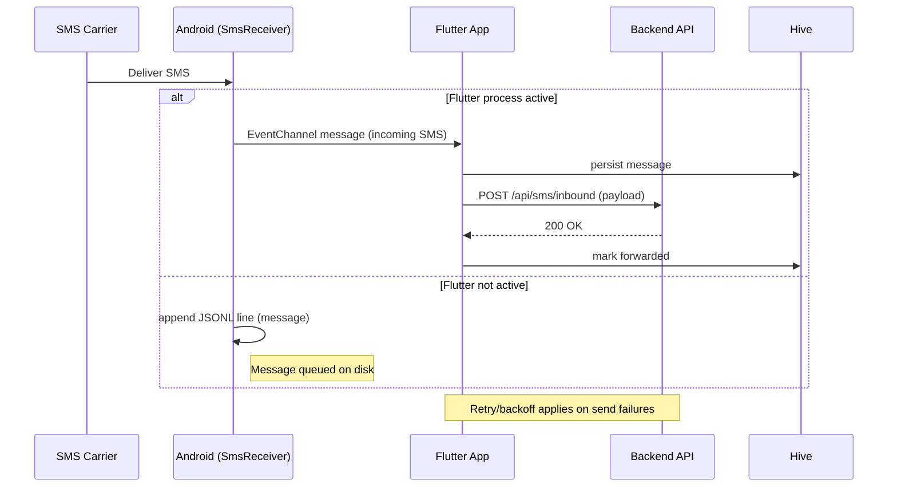
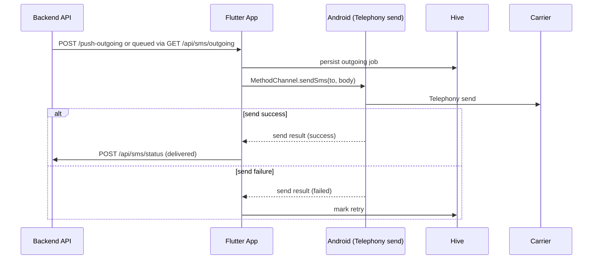

# SMS Gateway — Project Summary

Last updated: 2025-11-25

This document summarizes the SMS Gateway project: goals, architecture, phased implementation, notable design decisions, developer setup, testing guidance, and next steps.

## Project Purpose

The SMS Gateway is an Android-first Flutter application that provides a robust, reliable, two-way SMS relay between a device and a backend server. The device: captures incoming SMS messages, persists them locally, forwards them to a backend via HTTP; and executes outgoing SMS requests received from the backend. The solution emphasizes reliability (native SMS capture), local persistence and retry/queueing, and a small trusted UI for configuration and monitoring.

## High-Level Requirements

- Capture incoming SMS even when the Flutter app is not foregrounded.
- Persist incoming messages and an outgoing retry queue reliably on-device.
- Forward incoming messages to a configurable backend endpoint (HTTP POST) with retries and backoff.
- Poll or receive server-side instructions to send SMS from the device (server → device → SMS delivery).
- Minimal, secure UI for configuration, viewing message history, and manual queue controls.
- Use platform-native handling instead of unreliable plugins for SMS receipt/send on modern Android devices.

## Phased Implementation (what we built)

**Phase 1 — Flutter scaffold and core services**

- Project scaffolded with Flutter: `lib/` contains app code and modular services.
- Dependencies: `http`, `provider` (state), `hive` (local storage), `permission_handler`, `flutter_local_notifications` (optional), `connectivity_plus`.
- Implemented core app state, HTTP client, local persistence (Hive boxes), and a simple UI for status and settings.
- Implemented retry queue logic, message models, and HTTP forwarding logic with exponential backoff.

**Phase 2 — Native Android integration for SMS reliability**

- Replaced Flutter plugin reliance with native platform channels:
  - `MethodChannel` for sending SMS and controlling native behavior from Dart.
  - `EventChannel` or platform-side broadcast to stream incoming SMS events to Dart when app is active.
- Implemented `SmsReceiver.kt` (Android BroadcastReceiver) to capture inbound SMS at the OS level and persist them to a lightweight native queue (JSONL file) when the Flutter runtime is not available.
- On Flutter startup, the app imports the native JSONL queue into Hive (`importNativeQueue`) so messages captured while the app was inactive are processed and forwarded to the backend.
- Implemented native send handling to ensure messages are dispatched via Telephony APIs with proper permissions and status reporting.

## Architecture Overview

- Flutter layer (Dart):
  - UI: `lib/main.dart` + screens (status, history, settings)
  - App state (Provider): manages message lists, retry queue, polling loop, and interaction with native services.
  - Services: `android_sms_service.dart` (platform channels), `http_service.dart`, retry/backoff logic, Hive storage adapters.

- Android native layer (Kotlin):
  - `SmsReceiver.kt`: BroadcastReceiver capturing `SMS_RECEIVED` and writing event lines to a JSONL file when the app process is not active.
  - `MainActivity.kt`: registers platform channels (`MethodChannel`, `EventChannel`) and provides helper methods to send SMS and flush native queue.
  - `AndroidManifest.xml`: declares permissions (`RECEIVE_SMS`, `SEND_SMS`, `READ_SMS` as needed) and receiver exports/flags compatible with modern Android.

## Data Flow

1. Incoming SMS arrives on device.
2. `SmsReceiver` is invoked by the OS. If the app is alive, an EventChannel push forwards the message to Dart; otherwise receiver appends the message to the JSONL queue on disk.
3. On Flutter startup (or when resumed), `importNativeQueue()` reads JSONL, inserts messages into Hive and enqueues them for forwarding.
4. App attempts HTTP POST to the configured backend endpoint with the message payload. On success the message is marked delivered/archived. On failure it enters the retry mechanism.
5. For outgoing messages, the app polls the backend (or receives push instructions) and enqueues outgoing SMS. A native send method is invoked to dispatch the SMS via Telephony APIs; send status is recorded and returned to the server where possible.

## API & Message Format

- HTTP Forwarding (device → server):
  - Endpoint (configurable): `POST /api/sms/inbound`
  - Payload (JSON):
    {
      "id": "uuid",
      "from": "+1234567890",
      "body": "Message text",
      "timestamp": "2025-11-25T12:34:56Z",
      "metadata": { ... }
    }

- Outgoing polling / push (server → device):
  - Polling endpoint: `GET /api/sms/outgoing` (returns queued SMS to send)
  - Sending acknowledgment: `POST /api/sms/status` with delivery or failure info

Note: Endpoints are illustrative. The app exposes settings for `backendUrl`, `deviceId`, `apiKey` and polling interval.

## Installation & Developer Setup

Prerequisites: Flutter SDK, Android SDK, Java/Kotlin toolchain. A physical Android device is recommended for end-to-end SMS tests.

1. Clone repo and fetch packages:

```bash
flutter pub get
```

2. Run analyzer and tests:

```bash
flutter analyze
flutter test
```

3. Run on device (recommended):

```bash
flutter run -d <device-id>
```

4. Build an APK for deployment:

```bash
flutter build apk --release
```

## Permissions & Android Notes

- Required runtime permissions on Android:
  - `RECEIVE_SMS` — receive SMS messages
  - `SEND_SMS` — send SMS from device
  - `READ_SMS` — if reading stored messages is needed (optional)
  - `FOREGROUND_SERVICE` — if foreground service is used for background reliability

- On Android 8+ and newer, background execution and implicit broadcast delivery rules changed. Using a foreground service or platform-native BroadcastReceiver plus JSONL persistence ensures messages are not lost when the Flutter runtime is not active.

- AndroidManifest and receiver flags were configured to be compatible with Android 12/13+ export rules (e.g., `exported` flag and permission checks).

## Testing Guidance

- Unit tests: `flutter test` covers core Dart logic (retry/backoff, storage adapters, HTTP client mocks).
- Integration / E2E: Use a real device to validate native SMS receipt/send. Emulators can simulate incoming SMS but may not reflect real-world delivery conditions.
- Steps for manual device testing:
  1. Install debug APK on your Android device (use `flutter run`).
  2. Grant runtime SMS permissions when prompted or via `adb`.
  3. Send an SMS to the device from another phone; observe local persistence and forwarding to the backend.
  4. Use the backend test endpoint to queue an outgoing SMS and confirm device sends it.

## Security Considerations

- Store secrets (API keys) securely — the sample app uses secure storage patterns where practical. Avoid hardcoding sensitive values.
- Use HTTPS for all backend communications and validate server certificates.
- Minimize exported components; require explicit permissions for the BroadcastReceiver and avoid exposing interfaces to untrusted apps.

## Known Issues & Limitations

- Foreground/background service: a robust foreground service for very long-running background processing is implemented as a scaffold and may require tuning for specific OEM battery policies.
- SMS permissions and OEM behavior vary across vendors — users may need to whitelist the app from aggressive battery optimizations.
- iOS: The current project targets Android for SMS functionality. iOS cannot access SMS in the same way and is intentionally unsupported for this feature set.

## Next Steps & Enhancements

- Harden the foreground service and test across multiple OEM devices (Samsung, Xiaomi, Huawei).
- Add FCM (push) support so the server can push outgoing SMS instructions to the device (reduces polling).
- Add encryption at rest for the native JSONL queue and Hive storage if required by threat model.
- Implement delivery receipts handling (per-SIM carrier support varies) and reporting to the server.

## Files of Interest

- Flutter/Dart: `lib/main.dart`, `lib/src/providers/app_state.dart`, `lib/src/services/android_sms_service.dart`, `lib/src/services/http_service.dart`
- Android native: `android/app/src/main/kotlin/.../SmsReceiver.kt`, `MainActivity.kt`, `AndroidManifest.xml`
- Storage: Hive adapters and native JSONL import logic (`importNativeQueue` in Dart and native JSONL write in `SmsReceiver.kt`).

## Contributors

- Project initiated and implemented in collaboration with project owner (dev) and AI-assisted development.

---

For more details on any section above (example payloads, configuration screenshots, or to add CI/CD steps), ask and I will expand this summary into dedicated docs or create `docs/` files.

## Diagrams & Flow

Below are diagrams and stepwise flows to make the system behavior explicit. The diagrams include both a lightweight ASCII/flow form (works in any viewer) and Mermaid-compatible sequence diagrams (many Markdown renderers support Mermaid).

### 1) System Components (ASCII)

  [SMS Carrier]
       |
       v
  [Android Device - Native Receiver]
       |  (persist JSONL when Flutter down)
       v
  [Flutter App (Dart) ------- native bridge (Method/Event Channels) ]
       |                          ^
       | HTTP POST (inbound)      | Native send/ack
       v                          |
  [Backend API] <---- HTTP POST / GET ----> [Device]

Notes:
- Native Receiver = Android `SmsReceiver.kt` (writes JSONL when runtime not active).
- Flutter App imports JSONL at startup and processes messages through Hive + retry queue.

### 2) Inbound SMS Sequence (Mermaid)



### 3) Outgoing SMS Sequence (Mermaid)



### 4) HTTP Request/Response Examples

- Inbound forwarding (device → server):

  POST /api/sms/inbound
  Headers: `Authorization: Bearer <apiKey>`, `Content-Type: application/json`
  Body:

  {
    "id": "uuid-1234",
    "deviceId": "device-001",
    "from": "+1234567890",
    "body": "Hello from user",
    "timestamp": "2025-11-25T12:34:56Z"
  }

  Response: 200 OK / 4xx/5xx on error

- Poll outgoing (device → server):

  GET /api/sms/outgoing?deviceId=device-001
  Response 200 JSON:
  [
    { "id": "out-1", "to": "+0987654321", "body": "Reply text", "sendBy": "2025-11-25T12:40:00Z" }
  ]

- Acknowledge send status (device → server):

  POST /api/sms/status
  Body:
  {
    "id": "out-1",
    "deviceId": "device-001",
    "status": "sent", // or "failed"
    "timestamp": "2025-11-25T12:41:00Z",
    "details": "optional error or carrier id"
  }

### 5) Message Lifecycle (state machine)

- States:
  - RECEIVED_NATIVE: captured by `SmsReceiver` (or EventChannel delivered)
  - PERSISTED: stored in Hive or native JSONL
  - QUEUED_FOR_FORWARD: put into outgoing processing queue
  - SENDING: currently being forwarded (HTTP) or SMS being sent
  - SENT/ACKED: backend accepted or SMS sent successfully
  - FAILED: last attempt failed (retriable)
  - RETRYING: in retry/backoff schedule

Transitions:
- RECEIVED_NATIVE -> PERSISTED: immediate on capture
- PERSISTED -> QUEUED_FOR_FORWARD: scheduled for processing
- QUEUED_FOR_FORWARD -> SENDING: when worker picks job
- SENDING -> SENT/ACKED: on success
- SENDING -> FAILED: on permanent failure
- FAILED -> RETRYING -> QUEUED_FOR_FORWARD: when retry policy triggers

### 6) Queues and Persistence

- Native JSONL queue: append-only file used by `SmsReceiver` when Flutter is not active. Each line = JSON message object.
- Hive boxes: canonical in-app store for messages, retry queue, and app settings.

### 7) Polling vs Push (server → device)

- Polling (current default): device periodically calls `GET /api/sms/outgoing`. Pros: simple, works behind NAT. Cons: latency and battery.
- Push (recommended enhancement): server uses FCM to notify device of outgoing items. Pros: lower latency and battery use. Cons: requires FCM setup and secure binding to device id.

## Expanded Data Model (example)

- InboundMessage
  - `id` (string uuid)
  - `deviceId` (string)
  - `from` (string)
  - `body` (string)
  - `timestamp` (ISO 8601)
  - `status` (enum: pending/forwarded/failed)

- OutgoingJob
  - `id` (string uuid)
  - `to` (string)
  - `body` (string)
  - `createdAt` (ISO 8601)
  - `attempts` (int)
  - `nextAttemptAt` (timestamp)

If you'd like, I can also:
- generate PNG/SVG diagrams from these Mermaid blocks and add them to `docs/` (requires image generation permission), or
- create a `docs/diagrams/` folder with exported images and link them from this file.

